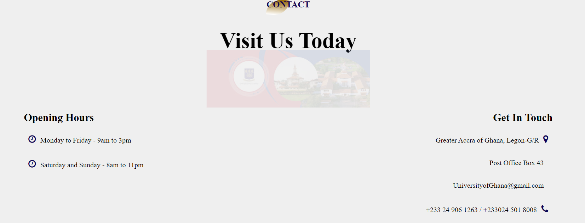
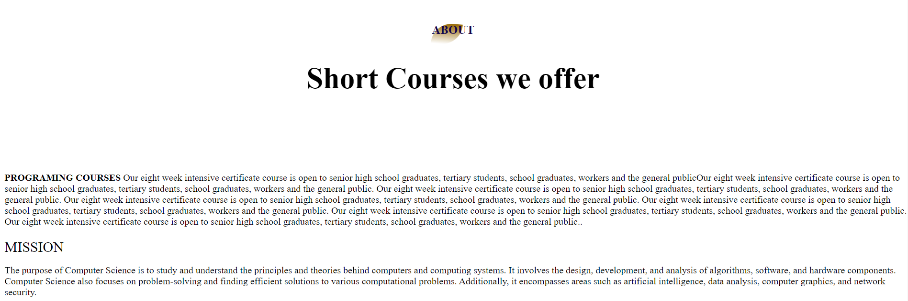

<h3 align="center">Hi 👋, I'm Certainly! Below is a template for a comprehensive README document for a fictional computer science website. You can customize it according to the actual details of your website. Computer Science department Introduction Welcome to niversity of Ghana Computer Science depaartment, your go-to destination for all things computer science and technology. Whether you're a seasoned developer, a curious student, or an enthusiast eager to explore the ever-evolving world of tech, you've landed in the right place</h3>

<h3 align="center">Purpose At Computer Science department, our primary purpose is to: Educate: Provide comprehensive tutorials, lessons, and learning materials covering a wide range of computer science topics, from fundamental concepts to advanced technologies. Connect: Foster a vibrant coding community where developers, programmers, and tech enthusiasts can collaborate, share knowledge, and engage in discussions to enhance their skills. Inform: Keep you updated with the latest tech news, trends, and industry insights, ensuring you stay at the forefront of the dynamic field of computer science. Inspire: Showcase innovative projects, share success stories, and offer career guidance to inspire and support individuals on their journey in the tech industry.</h3>

- 🔭 I’m currently working on **School website**

- 🌱 I’m currently learning **Information Technology**

- 🤝 I’m looking for help with **Open your terminal or command prompt. 2. Navigate to the directory where you want to clone the project. 3. Use the "git clone" command followed by the project's URL. In this case, the command would be: git clone https://github.com/Grandson-svg/11204907_DCIT205.git 4. Press Enter to execute the command. This will create a local copy of the project on your machine. 5. Once the cloning process is complete, navigate into the project's directory using the "cd" command. For example: cd 11204907_DCIT205 6. Now, you can proceed with setting up the project according to its specific requirements. This may involve installing dependencies, configuring environment variables, or running any necessary setup scripts. Please refer to the project's documentation or README file for detailed instructions on how to set it up**

The benefit of creating this website is that it allows me to establish an online presence for your business or personal brand. it has help me to reach a wider audience, showcase my products or services, and provide information to potential customers or visitors. It has also help me to build credibility and trust with my audience, as a well-designed and informative website can make a positive impression. Additionally, a website can serve as a platform for various online marketing strategies, such as search engine optimization (SEO) and social media integration, which can help me drive traffic and increase conversions.

- 💬 Ask me about **11204907 Agyenim Boateng**

- 📫 How to reach me **dutchgbg@gmail.com**

<h3 align="left">Connect with me:</h3>

